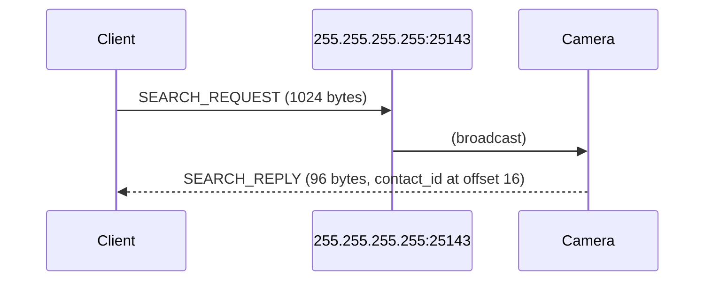
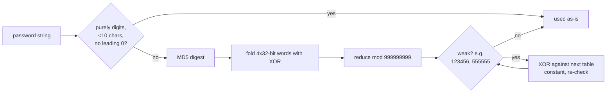
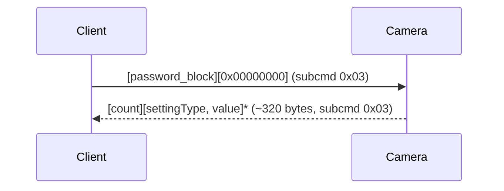
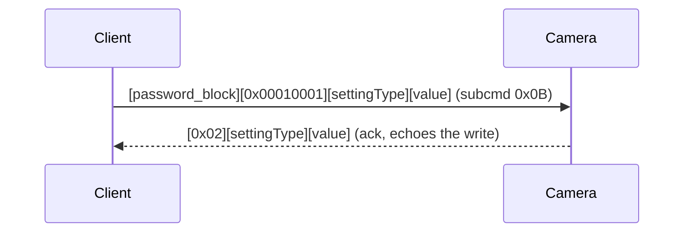
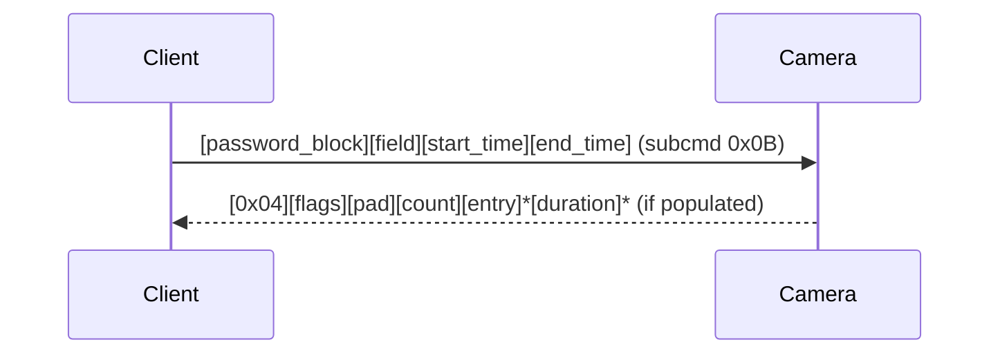

# Sricam/ieGeek LAN camera protocol

Reference for the UDP protocol these cameras speak on the local network.
Reverse-engineered from the official Android app (APK decompile + native
library disassembly) and confirmed against a real device. Only documents
what has been directly confirmed working; see
`custom_components/gwell_ipcam/api.py` for the reference implementation
this integration uses.

## Transport

UDP, port `51880` on the camera. No handshake, session, or connection
state is required — every request below is sent cold and answered
immediately. A client only needs to know the camera's IP and its admin
password.

### Discovery

A camera announces itself in response to a UDP broadcast on port `25143`.



## Frame format

Every request/response after discovery shares a 12-byte header:

```
 0        1        2        3        4                 8                 12
+--------+--------+--------+--------+--------+--------+--------+--------+
| 0x60   | subcmd |  dst   |  src   |          msgid (u32 LE)           |
+--------+--------+--------+--------+--------+--------+--------+--------+
|          size (u32 LE)            |            payload ...
+--------+--------+--------+--------+
```

- `subcmd`: `0x03` for reads, `0x0B` for writes.
- `dst`/`src`: single-byte identifiers; `dst` is the camera's own last IP
  octet, `src` can be any distinct small value.
- `size`: length of the payload that follows.

Most request payloads begin with an 8-byte authentication block (see
below); most response payloads begin with a command tag byte identifying
what follows.

## Authentication

Every write, and most reads, embed an 8-byte DES-ECB block as the first
8 bytes of the payload:

```
password_block = DES(key).decrypt(pack('<II', password_int, random_nonce))
```

`key` is `8c270a3eb9ec4d0e` for ordinary settings traffic. `password_int`
is derived from the admin password string:



The device does not invalidate its previous password immediately on a
password change — both the current and the immediately-previous password
continue to authenticate for some time after a change. A genuinely
unused/random password is rejected cleanly.

## Settings read/write

The bulk of camera configuration is a single dump of `settingType -> u32
value` pairs.



Write a single value:



Writes apply with several seconds of latency — re-read after 6-10s to
observe the change, not immediately after the ack.

### Confirmed settingType values

| ID | Name | Values |
|---:|---|---|
| 0 | Alarm Switch (`remote_defence`) | 0=off, 1=on — audible alarm |
| 1 | Buzzer | 0=off, 1-3=on, minutes duration |
| 2 | Motion Detection Alarm | 0/1 |
| 3 | Record Mode (`record_type`) | 0=Manual, 1=Alarm, 2=Timing |
| 4 | Manual Record switch (`remote_record`) | 0/1 — starts/stops recording in Manual mode |
| 8 | Video Standard (`video_format`) | 0=NTSC, 1=PAL |
| 11 | Record Time | 0/1/2 — wire is 0-indexed, UI shows 1/2/3 min |
| 13 | Network Type (`net_type`) | 0=Wired, 1=WiFi |
| 14 | Volume | 0-9, 9=max |
| 20 | Timezone | see [Timezone encoding](#timezone-encoding) |
| 24 | Image Reverse (`image_flip`) | 0/1 |
| 28 | Motion Sensitivity | lower = more sensitive |

## Timezone encoding

Timezone is not the raw UTC offset. The app's timezone picker is a wheel
of 30 positions (whole-hour offsets from UTC-11 to UTC+12, with a handful
of half-hour zones inserted at fixed points), and the wire value is the
wheel's *position*, not the offset:

```
wire_value = TIMEZONE_HALF_ZONE_TABLE[wheel_position]
TIMEZONE_HALF_ZONE_TABLE = (0,1,2,3,4,5,6,7,29,8,9,10,11,12,13,14,25,15,
                             26,16,24,17,27,18,19,20,28,21,22,23)
```

Positions 0-7 map 1:1 to UTC-11..UTC-4. Position 8 is an inserted
half-hour zone (wire value 29). From position 9 onward (UTC-3 and later),
`wire_value = wheel_position - 1`. Confirmed live: position 1 (UTC-10) →
wire value 1; position 13 (UTC+1) → wire value 12.

## Extended commands

A second family of requests, distinguished by a one-byte command tag
right after the password block, covers features outside the generic
settings dump. Each has its own request tag; several distinguish **read**
from **write** with entirely different tag bytes, not a flag — mixing
them up silently performs the wrong operation.

```
[password_block][tag][tag-specific payload]  ->  [tag_or_related][response fields]
```

| Feature | Request tag | Response tag | Notes |
|---|---|---|---|
| Record Quality — read | `0xF0` | `0xF1` | value at response offset 2, range 0-4 |
| Record Quality — write | `0xEF` | `0xF1` (async) | **different tag from read** |
| SD card capacity | `0x50` | `0x50` | total/free (u32 LE, ×16 = MB) at offsets 8/16; `SDcardID` (needed for format) at offset 4 |
| Format SD card | `0x51` | `0x51` | destructive; `sd_id` = the `SDcardID` byte from the capacity response; result code at response offset 1 (80=success, 81=fail, 82=no_sd, 103=must_stop_record) |
| Device time — read | `0x0A` | `0x0C` | year(u16 LE)/month/day/hour/minute |
| Device time — write | `0x0B` | `0x0C` (async) | same field layout as read response |
| Device info | `0x27` | `0x28` | version/uboot/cpu/system, see below |
| Firmware update check | `0x1D` | `0x1E` | pure LAN, no cloud call involved |
| WiFi scan | `0x10` | (variable) | SSID list + signal-strength array |
| Notification account list — read | `0x16` | `0x18` | list of account IDs |
| Notification account list — write | `0x17` | `0x18` (async) | `[0]` clears the list (not a truly empty array) |
| Network config write | (part of the `iSetNPCSettings`-style payload, tag `0x68`) | — | see below |

### Device info response

```
[0x28][result][pad×2][version:u32][uboot:u32][cpu:u32][system:u32]
```

`version`'s 4 bytes are read in **reverse** order —
`byte[3].byte[2].byte[1].byte[0]` — to form `major.minor.patch.build`
(e.g. `21.0.0.30`). The firmware update check response uses the same
reversed-byte encoding for both its version fields.

### Network config write

```
[0x68][0x01][0x00][mode][ip×4][subnet×4][gateway×4][dns×4]
```

`mode`: `0x00`=manual (explicit IP fields), `0x01`=auto/DHCP. Each 4-byte
IP field stores its octets in **reverse** order — `192.168.0.66` is sent
as bytes `42 00 A8 C0`.

## Admin password change

```mermaid
sequenceDiagram
    participant C as Client
    participant Cam as Camera
    C->>Cam: [password_block(old)][const][0x09][hash(new)]<br/>[md5("admin:HIipCamera:"+new)][len(new)]<br/>[enc(new, 8B chunks)][session tail]
    Cam-->>C: ack (structurally accepted; not independently\nverifiable beyond re-authenticating)
```

- `password_block(old)`: the usual auth block, keyed on the *current*
  password.
- `hash(new)`: the same password-hashing function as authentication,
  applied to the *new* password.
- The RTSP-style digest field is plain `MD5("admin:HIipCamera:" +
  new_password)`.
- `enc(new, ...)`: the new password itself, null-padded to 32 bytes,
  DES-ECB **encrypted** (not decrypted, unlike every other DES use in
  this protocol) in 8-byte chunks with a separate key.
- The trailing ~64 bytes are session-context echoes the camera does not
  appear to validate.

## Recorded file listing



Each entry is 8 bytes: `year(u16 LE)`, `(disc<<4)|month`, `day`, `hour`,
`minute`, `second`, `tag` (`'A'`=alarm-triggered, `'M'`=manual). If the
flags byte has bit 0 set, a parallel array of `u16 LE` durations (seconds)
follows the entries.

## Not covered here

Pan/tilt control and audio streaming are implemented in the reference
client (wire-format-correct per the decompiled app) but were never
confirmed to have a live effect — they depend on a separate session
establishment this project never got the camera to accept. Motion-
triggered push notifications are cloud-only (Firebase Cloud Messaging)
and have no LAN component at all.
