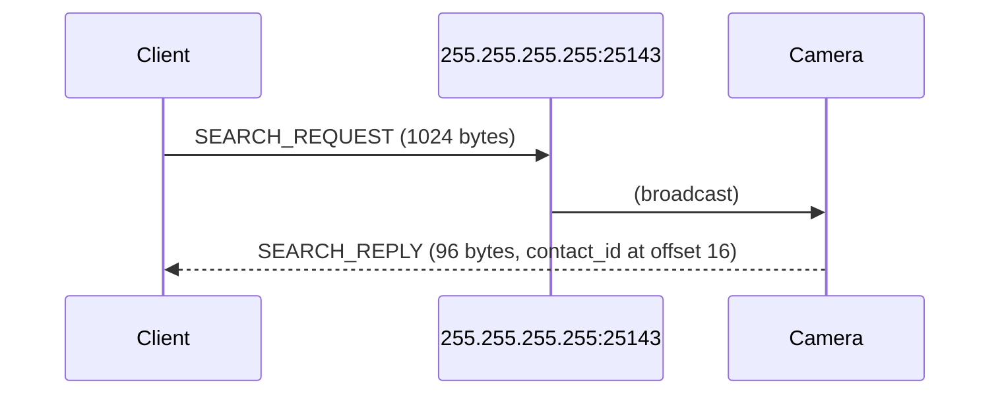
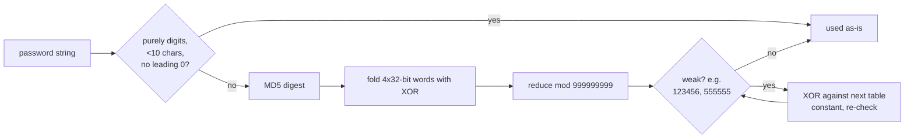
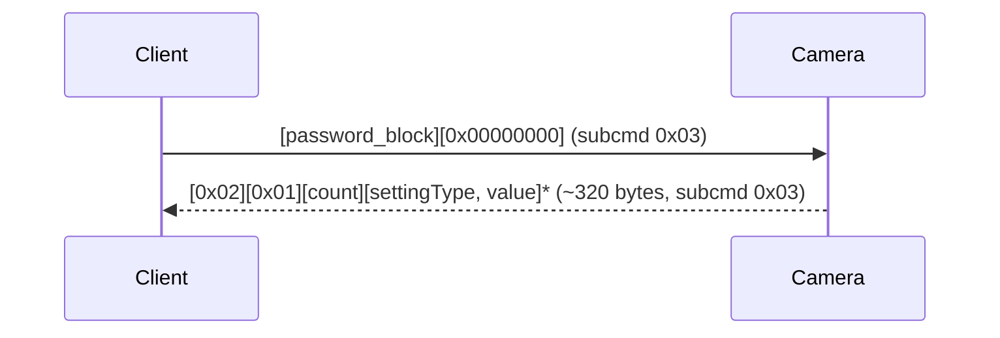
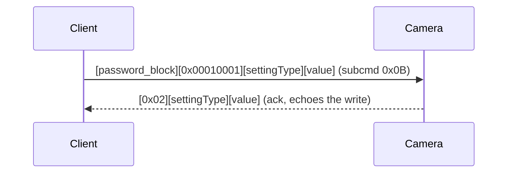
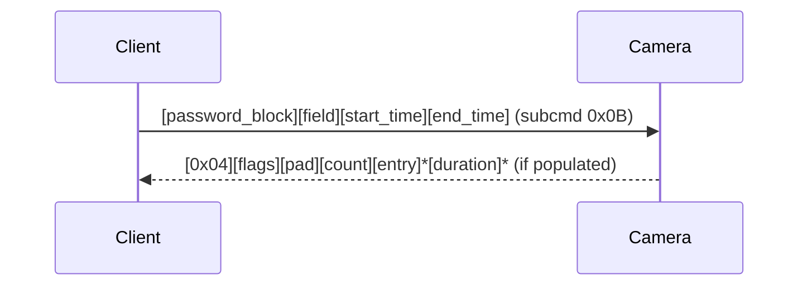

# Sricam/ieGeek LAN camera protocol

Reference for the two LAN protocols these cameras speak: a custom UDP
protocol for settings/control, and RTSP (with several non-standard
extensions) for video/audio streaming and PTZ. Reverse-engineered from the
official Android app (APK decompile + native library disassembly) and
confirmed against a real device.

## Transport

Two independent UDP ports are used, for entirely different purposes:

- **`25143`**: discovery only (broadcast). Used once, to find a camera's IP
  and `contact_id` before anything else.
- **`51880`**: every other request in this document (settings, extended
  commands, admin password change, recorded-file listing).

No handshake, session, or connection state is required on either port —
every request is sent cold and answered immediately. A client only needs
the camera's IP and its admin password.

One firmware quirk to know up front: **the client's source port must equal
the port it's sending to** (`51880`, or `25143` for discovery). Requests
from an arbitrary ephemeral source port are silently dropped — confirmed
live by binding the client socket to each port explicitly before send.

### Discovery

A camera announces itself in response to a UDP broadcast on port `25143`.



## Frame format

Every request/response on port `51880` shares a 12-byte header:

```
 0        1        2        3        4                 8                 12
+--------+--------+--------+--------+--------+--------+--------+--------+
| 0x60   | subcmd |  dst   |  src   |          msgid (u32 LE)           |
+--------+--------+--------+--------+--------+--------+--------+--------+
|          size (u32 LE)            |            payload ...
+--------+--------+--------+--------+
```

- `subcmd`: `0x03` for reads, `0x0B` for writes.
- `dst`/`src`: single-byte identifiers; `dst` is the camera's own last IP
  octet, `src` can be any distinct small value.
- `size`: length of the payload that follows.
- `msgid`: **not echoed by the camera** on any response payload observed so
  far — don't use it to correlate a specific response to a specific
  request. The ack responses (see below) do echo it; the actual data
  responses carry a different, camera-internal counter in that field
  instead.

Most request payloads begin with an 8-byte authentication block (see
below); most response payloads begin with a command tag byte identifying
what follows. A generic ack (`0x61`, echoing the request's `msgid`)
typically arrives first, followed shortly by the real data response
(`0x60`).

The camera also re-broadcasts several of its own state values (time,
record quality, settings) periodically and unprompted, independent of any
specific request — a client polling this port will see a steady trickle of
these even when idle. Don't assume every incoming packet matching an
expected response shape is actually a fresh reply to your most recent
request.

## Authentication

Every write, and most reads, embed an 8-byte DES-ECB block as the first
8 bytes of the payload:

```
password_block = DES(key).decrypt(pack('<II', password_int, random_nonce))
```

`key` is `8c270a3eb9ec4d0e` for ordinary settings traffic. `password_int`
is derived from the admin password string:



The device does not invalidate its previous password immediately on a
password change — both the current and the immediately-previous password
continue to authenticate for some time after a change. A genuinely
unused/random password is rejected cleanly.

## Settings read/write

The bulk of camera configuration is a single dump of `settingType -> u32
value` pairs.



`0x02 0x01` is the response tag. Check it: other large `0x60`-marked responses (e.g. recorded-file
listing) can otherwise be misread as a settings dump if they happen to also clear the length gate.

Write a single value:



Writes apply with several seconds of latency — re-read after 6-10s to
observe the change, not immediately after the ack.

### Confirmed settingType values

|  ID | Name                                   | Values                                        |
| --: | -------------------------------------- | --------------------------------------------- |
|   0 | Alarm Switch (`remote_defence`)        | 0=off, 1=on — audible alarm                   |
|   1 | Buzzer                                 | 0=off, 1-3=on, minutes duration               |
|   2 | Motion Detection Alarm                 | 0/1                                           |
|   3 | Record Mode (`record_type`)            | 0=Manual, 1=Alarm, 2=Timing                   |
|   4 | Manual Record switch (`remote_record`) | 0/1 — starts/stops recording in Manual mode   |
|   5 | Record schedule (`record_plan_time`)   | daily start/end time for Record Mode `Timing`, see [Record plan time encoding](#record-plan-time-encoding) |
|   8 | Video Standard (`video_format`)        | 0=NTSC, 1=PAL                                 |
|  11 | Record Time                            | 0/1/2 — wire is 0-indexed, UI shows 1/2/3 min |
|  13 | Network Type (`net_type`)              | 0=Wired, 1=WiFi                               |
|  14 | Volume                                 | 0-9, 9=max                                    |
|  20 | Timezone                               | see [Timezone encoding](#timezone-encoding)   |
|  24 | Image Reverse (`image_flip`)           | 0=normal, 1=mounted upside down. Also flips which physical direction PTZ pan commands move the image. |
|  28 | Motion Sensitivity                     | lower = more sensitive                        |

## Timezone encoding

The wire value is **not** the UTC offset — it's the position of a 30-entry
wheel the app's timezone picker steps through, and that wheel isn't in
plain UTC order (a handful of half-hour zones are spliced in at fixed
points). The table below maps wheel position directly to wire value; there
is no formula, just this lookup:

```
wheel position:  0  1  2  3  4  5  6  7  8  9 10 11 12 13 14 15 16 17 18 19 20 21 22 23 24 25 26 27 28 29
wire value:      0  1  2  3  4  5  6  7 29  8  9 10 11 12 13 14 25 15 26 16 24 17 27 18 19 20 28 21 22 23
```

Wheel positions 0-7 are UTC-11 through UTC-4, one per position. Position 8
is the first spliced-in half-hour zone (wire value 29). From position 9
onward, positions correspond to UTC-3 and later, offset by the splices
before them. Confirmed live: position 1 (UTC-10) → wire value 1; position
13 (UTC+1) → wire value 12.

## Record plan time encoding

`record_plan_time` (settingType 5) packs a single daily start/end time
window into the same u32 value every other settingType uses — it is not a
per-day-of-week bitmask, just one time-of-day range applied every day while
Record Mode is `Timing`. Traced directly from the decompiled app
(`MyUtils.convertPlanTime`, both directions):

```
 0                 1                 2                 3
+-----------------+-----------------+-----------------+-----------------+
| end_minute      | start_minute    | end_hour        | start_hour      |
+-----------------+-----------------+-----------------+-----------------+
```

i.e. as the u32 LE value every settingType uses: `value = end_minute |
(start_minute << 8) | (end_hour << 16) | (start_hour << 24)`.
Read and written exactly like any other settingType (0x03/0x0B) — there is
no separate dedicated command for it.

## Extended commands

A second family of requests, distinguished by a one-byte command tag right
after the password block, covers features outside the generic settings
dump. Each has its own request tag; several distinguish **read** from
**write** with entirely different tag bytes, not a flag — mixing them up
silently performs the wrong operation.

```
+--------+--------+------------------+
| 0x60   | 0x0B   | dst | src | msgid | (12-byte header, subcmd always 0x0B)
+--------+--------+------------------+
| password_block (8 bytes)           |
+-------------------------------------+
| tag    | tag-specific payload ...
+--------+
```

| Feature                           | Request tag                                               | Response tag   | Notes                                                                                                                                                         |
| ---------------------------------- | --------------------------------------------------------- | -------------- | ------------------------------------------------------------------------------------------------------------------------------------------------------------- |
| Record Quality — read              | `0xF0`                                                    | `0xF1`         | value at response offset 2, range 0-4                                                                                                                         |
| Record Quality — write             | `0xEF`                                                    | `0xF1` (async) | **different tag from read**                                                                                                                                   |
| SD card capacity                   | `0x50`                                                    | `0x50`         | total/free (u32 LE, ×16 = MB) at offsets 8/16; `SDcardID` (needed for format) at offset 4                                                                     |
| Format SD card                     | `0x51`                                                    | `0x51`         | destructive; `sd_id` = the `SDcardID` byte from the capacity response; result code at response offset 1 (80=success, 81=fail, 82=no_sd, 103=must_stop_record) |
| Device time — read                 | `0x0A`                                                    | `0x0C`         | year(u16 LE)/month/day/hour/minute                                                                                                                            |
| Device time — write                | `0x0B`                                                    | `0x0C` (async) | same field layout as read response                                                                                                                            |
| Device info                        | `0x27`                                                    | `0x28`         | version/uboot/cpu/system, see below                                                                                                                           |
| Firmware update check               | `0x1D`                                                    | `0x1E`         | LAN-only request/response, see below for how to read the result                                                                                              |
| WiFi scan                          | `0x10`                                                    | (variable)     | SSID list + signal-strength array                                                                                                                             |
| Notification account list — read   | `0x16`                                                    | `0x18`         | list of account IDs                                                                                                                                           |
| Notification account list — write  | `0x17`                                                    | `0x18` (async) | `[0]` clears the list (not a truly empty array)                                                                                                               |
| Network config write               | (part of the `iSetNPCSettings`-style payload, tag `0x68`) | —              | see below                                                                                                                                                     |

### Device info response

```
 0        1        2        3        4        5        6        7        8        9       10       11
+--------+--------+--------+--------+--------+--------+--------+--------+--------+--------+--------+--------+
| 0x28   | result | pad    | pad    |           version (4 bytes,             |           uboot (4 bytes,     |
|        |        |        |        |           reverse byte order)            |           reverse byte order) |
+--------+--------+--------+--------+--------+--------+--------+--------+--------+--------+--------+--------+
|           cpu (4 bytes, reverse byte order)                    |           system (4 bytes, reverse byte order) ...
+--------+--------+--------+--------+--------+--------+--------+
```

Each 4-byte version field is read in **reverse** byte order —
`byte[3].byte[2].byte[1].byte[0]` — to form `major.minor.patch.build`
(e.g. `21.0.0.30`).

### Firmware update check response

```
 0        1        2        3        4                                   8                                  12
+--------+--------+--------+--------+--------+--------+--------+--------+--------+--------+--------+--------+
| 0x1E   | result | pad    | pad    |     cur_version (4 bytes, reverse    |     upg_version (4 bytes, reverse
|        |        |        |        |     byte order, same encoding as    |     byte order, same encoding as
|        |        |        |        |     Device info above)              |     Device info above) ...
+--------+--------+--------+--------+--------+--------+--------+--------+--------+--------+--------+--------+
```

`result` values `1` and `72` mean an update is available (read
`upg_version`); anything else observed so far (including `53`, seen in
testing) means no update, and `upg_version` is `0.0.0.0` in that case. The
full meaning of every `result` code is not confirmed — treat any value
outside `{1, 72}` as "no update" rather than assuming it's exhaustive.

### Network config write

```
 0        1        2        3        4              8              12             16             20
+--------+--------+--------+--------+--------+--------+--------+--------+--------+--------+--------+--------+
| 0x68   | 0x01   | 0x00   | mode   |     ip (4 bytes,        |     subnet (4 bytes,   |     gateway (4 bytes,
|        |        |        |        |     reverse byte order) |     reverse byte order)|     reverse byte order) ...
+--------+--------+--------+--------+--------+--------+--------+--------+--------+--------+--------+--------+
```

Followed by a 4-byte `dns` field in the same reverse-byte-order encoding.
`mode`: `0x00`=manual (explicit IP fields), `0x01`=auto/DHCP. Each 4-byte
IP field stores its octets in reverse order — `192.0.2.10` is sent as
bytes `42 00 A8 C0`.

## Admin password change

```mermaid
sequenceDiagram
    participant C as Client
    participant Cam as Camera
    C->>Cam: password_block(old) + const + 0x09 + hash(new)
    C->>Cam: + md5("admin:HIipCamera:" + new) + len(new)
    C->>Cam: + enc(new, 8-byte chunks) + session tail
    Cam-->>C: ack (structurally accepted; not independently verifiable beyond re-authenticating)
```

- `password_block(old)`: the usual auth block, keyed on the _current_
  password.
- `hash(new)`: the same password-hashing function as authentication,
  applied to the _new_ password.
- The digest field is plain `MD5("admin:HIipCamera:" + new_password)`.
- `enc(new, ...)`: the new password itself, null-padded to 32 bytes,
  DES-ECB **encrypted** (not decrypted, unlike every other DES use in
  this protocol) in 8-byte chunks with a separate key.
- The trailing ~64 bytes are session-context echoes the camera does not
  appear to validate.

## Recorded file listing



Each entry is 8 bytes:

```
 0                 2        3        4        5        6        7
+--------+--------+--------+--------+--------+--------+--------+--------+
|   year (u16 LE)  | disc<<4|  day   |  hour  | minute | second |  tag   |
|                  | |month |        |        |        |        |        |
+--------+--------+--------+--------+--------+--------+--------+--------+
```

`tag` is `'A'` (alarm-triggered) or `'M'` (manual). If the response's
`flags` byte has bit 0 set, a parallel array of `u16 LE` durations
(seconds), one per entry, follows the entry list.

## RTSP (video/audio streaming, PTZ, push-to-talk)

Standard RTSP/1.0 over TCP, port `554`, path `/onvif1` — but with several
non-standard extensions and a couple of RFC-noncompliant quirks a strict
RTSP client (ffmpeg, go2rtc) will choke on unless corrected:

- **`SETUP` response omits `/TCP` from the `Transport` header.** The
  camera replies with `Transport: RTP/AVP;unicast;...` even though
  interleaved TCP is the only transport that actually works — a
  spec-compliant client reads this as "you asked for TCP, I'm giving you
  something else" and refuses to proceed. Any client talking to this
  camera directly needs to patch this header before parsing it, or use a
  fixing proxy in front of it (see `rtsp_proxy.py` in this integration).
- **Interleaved binary framing** is used for both directions once
  `PLAY`/`AudioCtlCmd:OPEN` is active: a 4-byte header (`0x24` marker + 1
  channel byte + 2-byte big-endian length) prefixes each binary frame,
  multiplexed on the same TCP stream as plain-text RTSP
  requests/responses. A reader has to distinguish the two by checking
  whether the next byte is `0x24` or the literal text `RTSP`.
- **PTZ** is not a standard RTSP feature at all. It's sent as
  `SET_PARAMETER` with `Content-type: ptzCmd:UP` (or `DWON` — sic, not a
  typo in this doc, the camera's own firmware spells it that way — `LEFT`,
  `RIGHT`). There is no distance/speed/stop/zoom/preset concept on the
  wire: each command is a single fixed motor increment, and "move further"
  just means sending the command again. Direction is mirrored for pan
  (not tilt) when `Image Reverse` (settingType 24) is on.
- **Push-to-talk** is also not standard RTSP. `USER_CMD_SET` with
  `Content-type: AudioCtlCmd:OPEN` starts it and `AudioCtlCmd:CLOSE` ends
  it; audio itself is 8kHz mono PCM16, sent as interleaved binary frames
  (channel `0x02`) with a fixed framing: `0x24` + channel + 2-byte
  little-endian length + a 12-byte zero gap + up to 320 bytes (160
  samples, 20ms) of payload, paced to real time.
- **`Content-length` is a broken literal string, not a computed value.**
  Both `ptzCmd` and `AudioCtlCmd` requests set the header to the literal
  text `strlen(Content-type)` — not the actual length of the
  `Content-type` value. This looks like a leftover debug/template string
  in the camera's own firmware that made it into the real wire format;
  clients need to send this exact literal, not a real computed
  content-length, or the camera won't recognize the request.

## Not covered here

Recorded-video playback (retrieving the actual video bytes of a stored
clip, as opposed to just listing recordings) has no known wire command —
never reverse-engineered.
